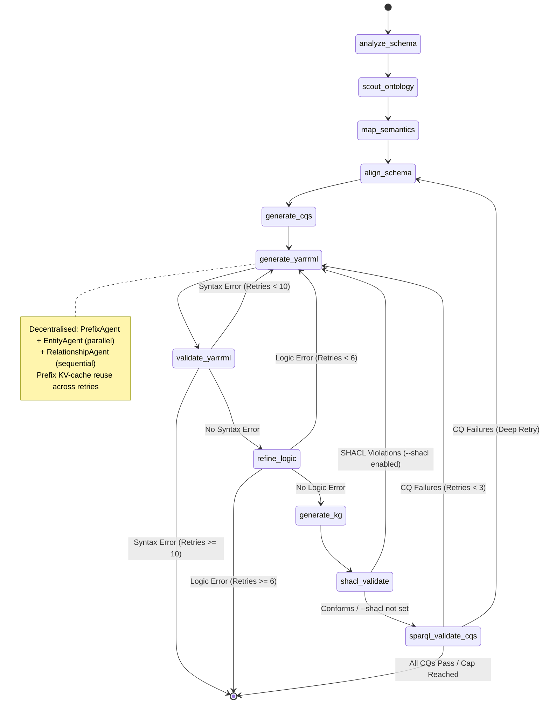

# Automap

**Agentic Knowledge Graph Generation**

**Project Status: Under Development** This project is currently in an active development phase.

## Overview

**Automap** is an agentic pipeline that leverages Large Language Models (LLMs) and [**LangGraph**](https://www.langchain.com/langgraph) to automate the creation of RML mappings and Knowledge Graph materialisation. The system uses a decentralised multi-agent architecture to analyse CSV schemas, scout ontologies, align schemas, generate Competency Questions (CQs), iteratively refine YARRRML mappings, and validate the final KG with both SPARQL and SHACL — all without manual intervention.



### Key Features

* **Decentralised YARRRML Generation:** YARRRML generation is split across three specialised agents — `PrefixAgent`, `EntityAgent`, and `RelationshipAgent`. The prefix and entity agents run in parallel, reducing overall generation time. Prefix declarations are reused via KV-caching so the prefix block is not regenerated on every retry.
* **Competency Question (CQ) Validation:** Auto-generates CQs from the schema and ontology, or accepts user-provided CQs. CQs are translated to SPARQL `ASK` queries by an LLM agent and executed against the materialised KG using an in-process [pyoxigraph](https://pyoxigraph.readthedocs.io/) store — no external SPARQL endpoint, username, or port configuration required.
* **SHACL Validation (Astrea + rdflib fallback):** Optional `--shacl` flag generates ontology-derived shapes using a three-tier strategy: (1) Astrea REST API, (2) local rdflib-based shape generation from OWL class/property declarations, (3) structural correctness shapes as a last resort. Violations trigger a targeted re-generation loop.
* **Multi-Agent Orchestration:** Specialised agents for schema analysis, ontology scouting, semantic mapping, schema alignment, CQ generation, YARRRML architecture, logic refinement, and SPARQL validation.
* **Self-Correction Loop:** Automatic syntax validation and logical refinement with up to 10 syntax retries and 6 logic retries.
* **Schema Alignment:** Detects multi-node vs. flat mapping structures; auto-injects missing columns and prevents disconnected mappings.
* **SPARQL Direct Validation:** Pass raw `ASK` queries via `--sparql` for deterministic checks (no LLM translation).
* **Base URI Control:** Override the subject namespace with `--base-uri` or the `BASE_URI` environment variable.
* **Multi-Level Evaluation:** Post-run evaluation covering pipeline success metrics, gold-standard KG comparison (precision/recall/F1), column coverage, and CQ coverage.
* **Terminal-Native Observability:** Real-time streaming of agent states, stage timings, and reasoning directly to the console.
* **Native Docker Support:** Pre-configured environment with automated compatibility patches.

---

## Pipeline Stages

| Stage | Description |
|---|---|
| **Schema Analysis** | Extracts column names, sample values, and infers data types from the input CSV. |
| **Ontology Scout** | Parses the provided ontology and identifies relevant classes, object properties, and data properties. |
| **Semantic Mapper** | Maps CSV columns to ontology concepts using LLM reasoning. |
| **Schema Alignment** | Determines flat vs. multi-node structure; plans entity subjects and cross-references. |
| **CQ Generator** | Auto-generates Competency Questions or uses user-supplied ones; saves to `cqs.txt`. |
| **YARRRML Generator** | Decentralised generation: PrefixAgent and EntityAgent run in parallel, then RelationshipAgent adds cross-mapping links. Prefix KV-cache is reused across retries. |
| **Syntax Validator** | Validates YARRRML syntax via `yatter`; retries on failure. |
| **Logic Refiner** | Checks for structural issues (disconnected mappings, missing columns, wrong datatypes); retries on failure. |
| **KG Generator** | Materialises the KG from the final YARRRML using `morph-kgc`. |
| **SHACL Validator** | (Optional, `--shacl`) Generates ontology-derived shapes via Astrea → rdflib local → structural fallback; validates the KG with pyshacl; retries on violations. |
| **SPARQL CQ Validator** | Translates CQs to SPARQL `ASK` queries (LLM) and executes them against an in-process pyoxigraph store; retries on failures with structured feedback. |

---

## Observability & Debugging

While [**LangGraph**](https://www.langchain.com/langgraph) is open-source, its primary visualisation tool, [**LangSmith**](https://docs.langchain.com/oss/python/langgraph/studio), often presents limitations:

* **Tier Constraints:** Free tiers have strict trace limits and data retention periods.
* **Privacy & Latency:** Sending agent traces to a third-party cloud is not always feasible.
* **Complexity:** Setup requires API keys and external dashboard management.

### **The "Terminal-First" Approach**

To keep this project lightweight and independent, we use **Native Terminal Streaming**. The pipeline uses a custom event-loop in `main.py` to provide real-time feedback:

* **Live Stage Tracking:** See exactly which node is active along with its elapsed time.
* **Stage Timing Table:** End-of-run summary showing time and relative progress bar for each stage.
* **Logic Refinement Feedback:** The `Logic Refiner` agent prints its specific structural critique directly to your terminal.
* **Syntax Validation:** Instant PASS/FAIL status reports with error excerpts.
* **SHACL Results:** Inline violation count, shapes source (Astrea / rdflib / structural), and retry routing decisions.
* **CQ Validation:** Per-question PASS/FAIL breakdown with SPARQL retry status.

---

## Installation & Setup

This project uses `uv` for fast Python dependency management and `docker` for containerised execution.

### 1. Local Environment Setup

Ensure you have [uv](https://github.com/astral-sh/uv) installed.

```bash
# Sync dependencies
uv sync

# Apply essential Morph-KGC compatibility patches
# NOTE: This script is currently optimised for Linux.
bash scripts/patch_morph_kgc.sh

# Set up your environment variables
cp .env.example .env  # Edit with your LLM API keys and file paths
```

### 2. Environment Variables

Copy `.env.example` to `.env` and fill in your values. All variables are optional unless marked **required**.

#### Provider & connection

| Variable | Description | Default |
|---|---|---|
| `LLM_PROVIDER` | LLM backend — `lm_studio` or `comet` | `lm_studio` |
| `LM_STUDIO_URL` | Base URL of your LM Studio server | `http://localhost:1234/v1` |
| `COMET_API_KEY` | Comet API key (only when `LLM_PROVIDER=comet`) | — |
| `COMET_MODEL` | Comet model name | `claude-opus-4-6` |
| `LANGSMITH_API_KEY` | LangSmith tracing key (optional) | — |

#### Model selection

| Variable | Description | Default |
|---|---|---|
| `LLM_MODEL_DEFAULT` | **Single knob** — model used by all agents unless overridden | `qwen2.5-coder-14b-instruct` |
| `LLM_MODEL_SCHEMA` | Override for schema analysis agent | `LLM_MODEL_DEFAULT` |
| `LLM_MODEL_MAPPER` | Override for semantic mapper agent | `LLM_MODEL_DEFAULT` |
| `LLM_MODEL_ALIGNMENT` | Override for schema alignment agent | `LLM_MODEL_DEFAULT` |
| `LLM_MODEL_YARRRML` | Override for prefix / entity / relationship agents | `LLM_MODEL_DEFAULT` |
| `LLM_MODEL_CQ` | Override for CQ generator & SPARQL translator | `LLM_MODEL_DEFAULT` |
| `LLM_MODEL_REFINER` | Override for logic refiner | `LLM_MODEL_DEFAULT` |

> **Tip:** To run a hybrid model configuration (e.g. DeepSeek for schema reasoning + Qwen for YARRRML generation), simply uncomment and set the relevant `LLM_MODEL_*` lines in your `.env` — no code changes needed.

#### Temperature & timeout

| Variable | Description | Default |
|---|---|---|
| `LLM_TEMP_SCHEMA` | Sampling temperature for schema agent | `0.3` |
| `LLM_TEMP_MAPPER` | Sampling temperature for mapper agent | `0.3` |
| `LLM_TEMP_ALIGNMENT` | Sampling temperature for alignment agent | `0.2` |
| `LLM_TEMP_YARRRML` | Sampling temperature for YARRRML agents | `0.3` |
| `LLM_TEMP_CQ` | Sampling temperature for CQ/SPARQL agent | `0.2` |
| `LLM_TEMP_REFINER` | Sampling temperature for refiner | `0.2` |
| `LLM_TIMEOUT` | Global request timeout in seconds (`0` = use per-role defaults) | `0` |

#### Input / output

| Variable | Description | Default |
|---|---|---|
| `INPUT_CSV_PATH` | **Required.** Path to the input CSV file | — |
| `INPUT_ONTOLOGY_PATH` | **Required.** Path to the input ontology (Turtle) | — |
| `BASE_URI` | Base namespace for all generated subject URIs | `http://mykg.org/resource/` |

### 3. Execution

```bash
# Basic run
uv run python main.py

# Run with SHACL validation (ontology-derived shapes: Astrea → rdflib → structural)
uv run python main.py --shacl

# Custom subject URI namespace
uv run python main.py --base-uri http://mykg.org/resource/

# User-provided Competency Questions
uv run python main.py --cqs "Which films exist?" "Who directed each film?"

# CQs from a file (one per line)
uv run python main.py --cqs @my_cqs.txt

# Direct SPARQL ASK validation (no LLM translation)
uv run python main.py --sparql "ASK { ?s a <http://dbpedia.org/ontology/Film> }"

# Full evaluation (all levels) with gold KG comparison
uv run python main.py --eval 1 2 3 --gold data/gold/my_gold.nt


# Combined: SHACL + user CQs + evaluation
uv run python main.py --shacl --cqs @cqs.txt --eval 1 2 3
```

### 4. Running via Docker (Recommended)

```bash
# Default run (reads INPUT_CSV_PATH / INPUT_ONTOLOGY_PATH from .env)
docker-compose up --build

# Pass extra CLI flags via the docker-compose `command:` key in docker-compose.yml:
#   command: ["--shacl", "--sparql", "--eval", "1", "2", "3"]

# Or inline with docker run:
docker run --rm --env-file .env -v $(pwd)/data:/app/data llm-agents_rml --shacl
```

The Dockerfile uses an `ENTRYPOINT` so any arguments appended to `docker run` or set in `docker-compose.yml` under `command:` are forwarded directly to `main.py`. Python 3.12 / Pandas 2.0 / NumPy 2.0 compatibility patches for `morph-kgc` are applied automatically at build time.

---

## Evaluation Levels

Run post-pipeline evaluation with `--eval`:

| Level | Description |
|---|---|
| **1** | Pipeline success metrics: YARRRML produced, syntactically valid, translatable, KG materialised, retry count, triple count, latency. |
| **2** | Gold-standard KG comparison: normalised triple match (precision/recall/F1), schema-level predicate/class comparison, hallucinated vs. missing predicates. |
| **3** | Column coverage: YARRRML template references vs. literal value match in the first CSV row. |
| **4** | CQ/SPARQL validation coverage (always included when CQs are present). |

```bash
# Level 1 only
uv run python main.py --eval 1

# All levels with a gold KG
uv run python main.py --eval 1 2 3 --gold data/gold/bikeshare_gold.nt
```

Metrics are saved as `eval_metrics.json` in the run directory.

---

## SHACL Validation

When `--shacl` is passed, the pipeline generates SHACL shapes using a three-tier strategy (dataset-agnostic — no hard-coded rules):

| Tier | Source | Shapes generated |
|---|---|---|
| **1. Astrea** | Remote REST API (`https://astrea.linkeddata.es`) | Full OWL-to-SHACL derivation |
| **2. rdflib local** | Ontology file parsed locally | NodeShapes per class; IRI constraints for object properties; Literal constraints for datatype properties |
| **3. Structural fallback** | Built-in | Subjects of `rdf:type` must be IRIs; objects of `rdf:type` must be IRIs |

All tiers use `inference="none"` in pyshacl to prevent RDFS-inferred false positives (typed literals being flagged as IRI violations).

### Deterministic violation repair (no LLM required)

Before routing violations back to the LLM generator, the pipeline attempts two deterministic fixes:

- **Pass A — prefix rewrite:** When an `owl:ObjectProperty` po entry already uses `~iri` but with a foreign ontology prefix (e.g. `dbo:Profession/$(col)~iri`), the prefix is rewritten to the subject base namespace (e.g. `example:Profession/$(col)~iri`). morph-kgc silently materialises foreign-namespace IRI templates as literals for plain-text columns; the base namespace is always handled correctly.
- **Pass B — literal-to-IRI conversion:** When an `owl:ObjectProperty` is mapped to a literal column (e.g. `[dbo:profession, $(category), xsd:string]`), the entry is deterministically rewritten to an IRI template (e.g. `[dbo:profession, example:Profession/$(category)~iri]`). This avoids unnecessary LLM retries for a purely structural constraint.

If the deterministic fix fully resolves the violation, the KG is re-materialised in-place and the pipeline continues without any retry.

### Persistent violation detection

Two safeguards prevent the LLM from over-engineering the mapping on SHACL retries:

1. **Same-fingerprint check:** If the identical violation fingerprint (MD5 of violation set) recurs on consecutive attempts, the pipeline accepts the KG without further retries.
2. **Superset check:** If the LLM adds new intermediate mappings or restructures the architecture — introducing *new* violations while the *original* ones are still present — the pipeline detects this as a regression and immediately accepts the KG, preventing runaway restructuring.

The feedback sent back to the generator on the first retry includes an explicit guard:
> *Do NOT add new intermediate mappings (e.g. CastMapping, RoleMapping). Do NOT create cast nodes or join nodes. ONLY fix the specific predicate(s) listed.*

On violations, the structured violation report is fed back into the YARRRML generator for a targeted fix (capped at `SHACL_MAX_RETRIES`, default 2).

SHACL shapes and the validation report are saved to the run directory (`shacl_shapes.ttl`, `shacl_report.txt`).

---

## Decentralised YARRRML Generation

Previously, the entire YARRRML document was produced by a single monolithic agent. The architecture has been refactored into three specialised sub-agents:

| Agent | Responsibility | Execution |
|---|---|---|
| **PrefixAgent** | Declares the `prefixes:` block | Parallel with EntityAgent |
| **EntityAgent** | Generates `mappings:` with data properties | Parallel with PrefixAgent |
| **RelationshipAgent** | Adds object-property PO entries (cross-mapping links) | Sequential, after assembly |

**Prefix KV-caching:** On retry iterations, the prefix block is reused from the previous attempt (unless the entity plan introduces new namespaces), avoiding redundant token generation for an unchanged prefix set.

**Base URI enforcement:** When `--base-uri` is set, the coordinator rewrites both subject (`s:`) URI templates *and* IRI object templates in `po:` entries (e.g. `dbo:Person/$(person_id)~iri` → `mykg:Person/$(person_id)~iri`) so the generated KG's entity URIs consistently reflect the user's own namespace across all triples.

---

## CQ Validation with SPARQL and Pyoxigraph

Competency Questions (CQs) are validated as follows:

1. CQs are generated automatically from the schema and ontology (or supplied by the user via `--cqs`).
2. Each CQ is translated to a SPARQL `ASK` query by a dedicated LLM agent, grounded with actual classes and predicates probed from the materialised KG.
3. Queries are executed against an **in-process [pyoxigraph](https://pyoxigraph.readthedocs.io/) store** — no external SPARQL endpoint, no localhost port, no credentials required.
4. Failed CQs trigger structured feedback to the YARRRML generator, identifying which triple patterns are absent from the KG.

---

## Output Structure

Each run produces a timestamped directory under `data/output/`:

```
data/output/run_YYYYMMDD_HHMMSS/
├── final_mapping.yaml        # Final YARRRML mapping
├── knowledge_graph.nt        # Materialised KG (N-Triples)
├── cqs.txt                   # Competency Questions used
├── sparql_validation.txt     # CQ validation report (human-readable)
├── sparql_validation.json    # CQ validation report (machine-readable)
├── shacl_shapes.ttl          # SHACL shapes used (if --shacl)
├── shacl_report.txt          # SHACL validation report (if --shacl)
├── eval_metrics.json         # Evaluation metrics (if --eval)
└── debug/
    ├── attempt_1.yaml        # YARRRML attempt history
    ├── attempt_2.yaml
    └── ...
```

---

## Post-Install Patches (Compatibility Note)

The upstream dependency `morph-kgc` requires specific patches to support Python 3.12, Pandas 2.0+, and Numpy 2.0+.

> [!IMPORTANT]
> **Platform Support:** The `scripts/patch_morph_kgc.sh` script is currently **Linux-only**.
> * **macOS Users:** You may need to install `gnu-sed` or manually adjust the `sed -i` commands in the script.
> * **Windows Users:** Please use the **Docker** installation or manually apply the changes listed below in your site-packages.

| File | Issue | Fix |
|---|---|---|
| `mapping_partitioner.py` | `value_counts()` index access | `.value_counts()[0]` → `.value_counts().iloc[0]` |
| `utils.py` | `np.NaN` alias removal | `np.NaN` → `np.nan` |

---

## Project Structure

* **`agents/`**: Core LLM logic — Schema, Mapper, Schema Alignment, Prefix, Entity, Relationship, CQ Generator, CQ-to-SPARQL, Refiner, and YARRRML Coordinator agents.
* **`graph/`**: LangGraph definitions (`workflow.py`) and all node execution logic (`nodes.py`), including SHACL and SPARQL validation nodes.
* **`config/`**: LLM settings, structured output schemas, YARRRML examples, and ontology prefix registry.
* **`data/`**: Input CSVs/Ontologies, checkpoint state definitions, and timestamped output run directories.
* **`evaluation/`**: Multi-level evaluation framework (`metrics.py`, `run_experiment.py`, `analyze_results.py`).
* **`scripts/`**: Critical patch scripts for upstream dependency fixes.

---

## Research & Citations

If you use this tool in an academic context, please cite:

**Morph-KGC**

* Arenas-Guerrero, J., et al. (2024). *An RML-FNML module for Python user-defined functions in Morph-KGC*. SoftwareX.
* Arenas-Guerrero, J., et al. (2024). *Morph-KGC: Scalable knowledge graph materialisation with mapping partitions*. Semantic Web.

**Yatter**

* Iglesias-Molina, A., et al. (2023). *Human-Friendly RDF Graph Construction: Which One Do You Chose?*. ICWE.

**Astrea**

* Cimmino, A., et al. (2020). *Astrea: Automatic Generation of SHACL Shapes from Ontologies*. ESWC.

---

## Acknowledgments

### Funding

This work has received funding from the **PIONERA** project (*Enhancing interoperability in data spaces through artificial intelligence*), a project funded in the context of the call for Technological Products and Services for Data Spaces of the **Ministry for Digital Transformation and Public Administration** within the framework of the **PRTR** funded by the **European Union (NextGenerationEU)**.


## Contributors

**Naveen Varma KALIDINDI** - naveen.kalidindi@upm.es

*Universidad Politécnica de Madrid (UPM)*
