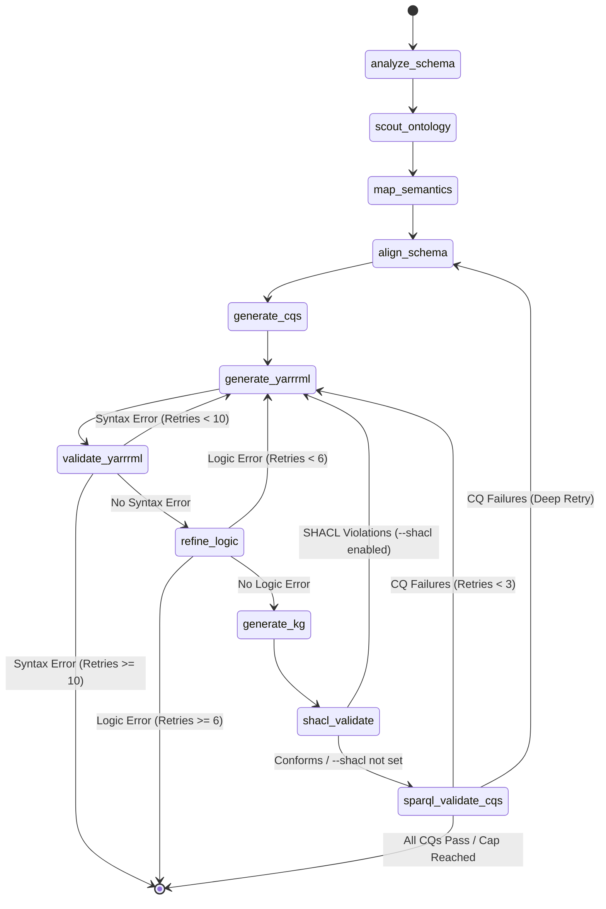

# Automap

**Agentic Knowledge Graph Generation**

**Project Status: Under Development** This project is currently in an active development phase.

## Overview

**Automap** is an agentic pipeline that leverages Large Language Models (LLMs) and [**LangGraph**](https://www.langchain.com/langgraph) to automate the creation of RML mappings and Knowledge Graph materialization. The system uses a multi-agent architecture to analyze CSV schemas, scout ontologies, align schemas, generate Competency Questions (CQs), iteratively refine YARRRML mappings, and validate the final KG — all without manual intervention.



### Key Features

* **Multi-Agent Orchestration:** Specialized agents for schema analysis, ontology scouting, semantic mapping, schema alignment, CQ generation, YARRRML architecture, logic refinement, and SPARQL validation.
* **Self-Correction Loop:** Automatic syntax validation and logical refinement with up to 10 syntax retries and 6 logic retries.
* **Schema Alignment:** Detects multi-node vs. flat mapping structures; auto-injects missing columns and prevents disconnected mappings.
* **Competency Question (CQ) Validation:** Auto-generates CQs from the schema+ontology or accepts user-provided CQs; translates them to SPARQL and validates against the materialized KG.
* **SHACL Validation (Astrea):** Optional `--shacl` flag derives shapes from the ontology via the [Astrea](https://astrea.linkeddata.es/) service (with a structural fallback), then validates the KG. Violations trigger a re-generation loop.
* **SPARQL Direct Validation:** Pass raw `ASK` queries via `--sparql` for deterministic checks (no LLM translation).
* **Base URI Control:** Override the subject namespace with `--base-uri` or the `BASE_URI` environment variable.
* **Multi-Level Evaluation:** Post-run evaluation covering pipeline success metrics, gold-standard KG comparison (precision/recall/F1), column coverage, and CQ coverage.
* **Terminal-Native Observability:** Real-time streaming of agent states, stage timings, and reasoning directly to the console.
* **Native Docker Support:** Pre-configured environment with automated compatibility patches.

---

## Pipeline Stages

| Stage | Description |
|---|---|
| **Schema Analysis** | Extracts column names, sample values, and infers data types from the input CSV. |
| **Ontology Scout** | Parses the provided ontology and identifies relevant classes, object properties, and data properties. |
| **Semantic Mapper** | Maps CSV columns to ontology concepts using LLM reasoning. |
| **Schema Alignment** | Determines flat vs. multi-node structure; plans entity subjects and cross-references. |
| **CQ Generator** | Auto-generates Competency Questions or uses user-supplied ones; saves to `cqs.txt`. |
| **YARRRML Generator** | Produces a YARRRML mapping from the semantic plan (iterative with retries). |
| **Syntax Validator** | Validates YARRRML syntax via `yatter`; retries on failure. |
| **Logic Refiner** | Checks for structural issues (disconnected mappings, missing columns, wrong datatypes); retries on failure. |
| **KG Generator** | Materialises the KG from the final YARRRML using `morph-kgc`. |
| **SHACL Validator** | (Optional, `--shacl`) Fetches ontology-derived shapes from Astrea, validates the KG, retries on violations. |
| **SPARQL CQ Validator** | Executes SPARQL queries (CQ-translated or user-direct) against the KG; retries on failures with structured feedback. |

---

## Observability & Debugging

While [**LangGraph**](https://www.langchain.com/langgraph) is open-source, its primary visualization tool, [**LangSmith**](https://docs.langchain.com/oss/python/langgraph/studio), often presents limitations:

* **Tier Constraints:** Free tiers have strict trace limits and data retention periods.
* **Privacy & Latency:** Sending agent traces to a third-party cloud isn't always feasible.
* **Complexity:** Setup requires API keys and external dashboard management.

### **The "Terminal-First" Approach**

To keep this project lightweight and independent, we use **Native Terminal Streaming**. The pipeline uses a custom event-loop in `main.py` to provide real-time feedback:

* **Live Stage Tracking:** See exactly which node is active along with its elapsed time.
* **Stage Timing Table:** End-of-run summary showing time and relative progress bar for each stage.
* **Logic Refinement Feedback:** The `Logic Refiner` agent prints its specific structural critique directly to your terminal.
* **Syntax Validation:** Instant PASS/FAIL status reports with error excerpts.
* **SHACL Results:** Inline violation count and retry routing decisions.
* **CQ Validation:** Per-question PASS/FAIL breakdown with SPARQL retry status.

---

## Installation & Setup

This project uses `uv` for lightning-fast Python dependency management and `docker` for containerized execution.

### 1. Local Environment Setup

Ensure you have [uv](https://github.com/astral-sh/uv) installed.

```bash
# Sync dependencies
uv sync

# Apply essential Morph-KGC compatibility patches
# NOTE: This script is currently optimized for Linux.
bash scripts/patch_morph_kgc.sh

# Set up your environment variables
cp .env.example .env  # Edit with your LLM API keys and file paths
```

### 2. Environment Variables

| Variable | Description | Default |
|---|---|---|
| `INPUT_CSV_PATH` | Path to the input CSV file | — |
| `INPUT_ONTOLOGY_PATH` | Path to the input ontology (Turtle) | — |
| `BASE_URI` | Base namespace for subject URIs | `http://example.org/` |
| `LLM_BASE_URL` | LLM API base URL (OpenAI-compatible) | — |
| `LLM_MODEL` | Default LLM model name | — |
| `CQ_SPARQL_MAX_RETRIES` | Max CQ validation retries | `3` |

Per-role model overrides (`LLM_MODEL_SCHEMA`, `LLM_MODEL_MAPPER`, `LLM_MODEL_REFINER`, etc.) are also supported.

### 3. Execution

```bash
# Basic run
uv run python main.py

# Run with SHACL validation (ontology-derived shapes via Astrea)
uv run python main.py --shacl

# Custom subject URI namespace
uv run python main.py --base-uri http://mykg.org/resource/

# User-provided Competency Questions
uv run python main.py --cqs "Which films exist?" "Who directed each film?"

# CQs from a file (one per line)
uv run python main.py --cqs @my_cqs.txt

# Direct SPARQL ASK validation (no LLM translation)
uv run python main.py --sparql "ASK { ?s a <http://dbpedia.org/ontology/Film> }"

# Full evaluation (all levels) with gold KG comparison
uv run python main.py --eval 1 2 3 --gold data/gold/my_gold.nt


# Combined: SHACL + user CQs + evaluation
uv run python main.py --shacl --cqs @cqs.txt --eval 1 2 3
```

### 4. Running via Docker (Recommended)

```bash
docker-compose up --build
```

The Dockerfile automatically handles Python 3.12 compatibility patches for `morph-kgc`.

---

## Evaluation Levels

Run post-pipeline evaluation with `--eval`:

| Level | Description |
|---|---|
| **1** | Pipeline success metrics: YARRRML produced, syntactically valid, translatable, KG materialised, retry count, triple count, latency. |
| **2** | Gold-standard KG comparison: normalised triple match (precision/recall/F1), schema-level predicate/class comparison, hallucinated vs. missing predicates. |
| **3** | Column coverage: YARRRML template references vs. literal value match in the first CSV row. |
| **4** | CQ/SPARQL validation coverage (always included when CQs are present). |

```bash
# Level 1 only
uv run python main.py --eval 1

# All levels with a gold KG
uv run python main.py --eval 1 2 3 --gold data/gold/bikeshare_gold.nt
```

Metrics are saved as `eval_metrics.json` in the run directory.

---

## SHACL Validation

When `--shacl` is passed, the pipeline:

1. Calls the [Astrea](https://astrea.linkeddata.es/) API with the ontology classes/properties to derive SHACL shapes automatically (dataset-agnostic — shapes come from the ontology, not hardcoded rules).
2. Falls back to built-in structural shapes (IRI subject checks, `rdf:type` value checks) if Astrea is unavailable (HTTP 406 / timeout).
3. Validates the materialised KG using [pyshacl](https://github.com/RDFLib/pySHACL).
4. On violations, feeds the violation report back into the YARRRML generator for a targeted fix attempt (capped at the global retry limit).

SHACL shapes and the validation report are saved to the run directory (`shacl_shapes.ttl`, `shacl_report.txt`).

---

## Output Structure

Each run produces a timestamped directory under `data/output/`:

```
data/output/run_YYYYMMDD_HHMMSS/
├── final_mapping.yaml        # Final YARRRML mapping
├── knowledge_graph.nt        # Materialised KG (N-Triples)
├── cqs.txt                   # Competency Questions used
├── sparql_validation.txt     # CQ validation report (human-readable)
├── sparql_validation.json    # CQ validation report (machine-readable)
├── shacl_shapes.ttl          # SHACL shapes used (if --shacl)
├── shacl_report.txt          # SHACL validation report (if --shacl)
├── eval_metrics.json         # Evaluation metrics (if --eval)
└── debug/
    ├── attempt_1.yaml        # YARRRML attempt history
    ├── attempt_2.yaml
    └── ...
```

---

## Post-Install Patches (Compatibility Note)

The upstream dependency `morph-kgc` requires specific patches to support Python 3.12, Pandas 2.0+, and Numpy 2.0+.

> [!IMPORTANT]
> **Platform Support:** The `scripts/patch_morph_kgc.sh` script is currently **Linux-only**.
> * **macOS Users:** You may need to install `gnu-sed` or manually adjust the `sed -i` commands in the script.
> * **Windows Users:** Please use the **Docker** installation or manually apply the changes listed below in your site-packages.

| File | Issue | Fix |
|---|---|---|
| `mapping_partitioner.py` | `value_counts()` index access | `.value_counts()[0]` → `.value_counts().iloc[0]` |
| `utils.py` | `np.NaN` alias removal | `np.NaN` → `np.nan` |

---

## Project Structure

* **`agents/`**: Core LLM logic — Schema, Mapper, Schema Alignment, Prefix, Entity, Relationship, CQ Generator, Refiner, and YARRRML Coordinator agents.
* **`graph/`**: LangGraph definitions (`workflow.py`) and all node execution logic (`nodes.py`), including SHACL and SPARQL validation nodes.
* **`config/`**: LLM settings, structured output schemas, YARRRML examples, and ontology prefix registry.
* **`data/`**: Input CSVs/Ontologies, checkpoint state definitions, and timestamped output run directories.
* **`evaluation/`**: Multi-level evaluation framework (`metrics.py`, `run_experiment.py`, `analyze_results.py`).
* **`scripts/`**: Critical patch scripts for upstream dependency fixes.

---

## Research & Citations

If you use this tool in an academic context, please cite:

**Morph-KGC**

* Arenas-Guerrero, J., et al. (2024). *An RML-FNML module for Python user-defined functions in Morph-KGC*. SoftwareX.
* Arenas-Guerrero, J., et al. (2024). *Morph-KGC: Scalable knowledge graph materialization with mapping partitions*. Semantic Web.

**Yatter**

* Iglesias-Molina, A., et al. (2023). *Human-Friendly RDF Graph Construction: Which One Do You Chose?*. ICWE.

**Astrea**

* Cimmino, A., et al. (2020). *Astrea: Automatic Generation of SHACL Shapes from Ontologies*. ESWC.

---

## Acknowledgments

### Funding

This work has received funding from the **PIONERA** project (*Enhancing interoperability in data spaces through artificial intelligence*), a project funded in the context of the call for Technological Products and Services for Data Spaces of the **Ministry for Digital Transformation and Public Administration** within the framework of the **PRTR** funded by the **European Union (NextGenerationEU)**.


## Contributors

**Naveen Varma KALIDINDI** - naveen.kalidindi@upm.es

*Universidad Politécnica de Madrid (UPM)*
